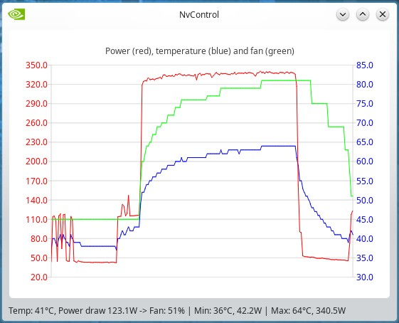

# nVidia NVML C++/QT5/6 tools

## Introduction
NVML is a library which comes with nVidia drivers, it does only talk to the driver, nothing else.<br/>
With NVML, you can query or command your nVidia cards on Linux without any display technology, for example nVidia Setting is limited to X11 on Linux.<br/>
NVML works fine with Wayland or Windows or even a tty.

nVidia did a lot of work on the NVML library for the gaming cards, it is not limited to the professional ones anymore.

It is not that difficult to use the NVML library from a C++ program, but most of the people do not know where to start.<br/>
So is the goal of this repository.

Foot note: I know C++ quite well and QT a bit less well, then my code tends to mix STD and QT types, so be  aware it's not that pretty.

## CodeLibrary program
I did not plan to make it executable, but I changed my mind. It contains some example queries and will enumerate your nVidia cards then display information.<br/>
It's written as simple as possible to inspire and provide examples for different types of data.

This is what it outputs on my PC with one card only. If you have several cards installed, it will give this information for each one.

```
Card Count: 1
Card 0 name: NVIDIA GeForce RTX 3090
Card 0 is of kind UNKNOWN (0)
Card 0 has 24 GB memory (12063 MB used, 12512 MB free)
Card 0 is operating on PCIe Gen3 (Max Gen4) 16 lines width
Card 0 has 10496 CUDA cores
Card 0 die temperature: 49°C
Card 0 power usage: 319.39 W (319395 mW)
Card 0 die clock 1965 Mhz, RAM clock 9751 Mhz
Card 0 has 2 fans
  Card 0 fan 0 speed: 46%
  Card 0 fan 1 speed: 45%
Card 0 clock offsets:
  RAM min -2000, RAM max 6000
  GPC min -1000, GPC max 1000
Card 0 current offset RAM 0, GPC 0
Card 0 power limit: 350 W
```
This one is using CMAKE, so to compile it:

```
mkdir build/
cd build/
cmake -DCMAKE_BUILD_TYPE=Release ../
make
```
You will then find CardsInfo in the build directory. The executable was not the goal, the goal was to show how this works but it's a good way to test things in the end.

You can find all the library functions from nVidia web site:<br/>
Query functions: https://docs.nvidia.com/deploy/nvml-api/group__nvmlDeviceQueries.html<br/>
Command functions: https://docs.nvidia.com/deploy/nvml-api/group__nvmlDeviceCommands.html

You can expand this example as much as you want.<br/>
Just know that command functions require root privilege for most of them.

This then transition well with the next one: A fan controller I wrote years ago using nVidia X tools, and ported to NVML recently when Gentoo (The linux I am using) migrated from Plasma 5 to Plasma 6.1. I feel the need to switch from Xorg to Wayland and I had to suffer from nVidia tools not working anymore. So I then ported my fan tool to NVML.

## Simple Fan custom curve application
My graphic card is a powerful one but not a proper made one. It's a Zotac RTX 3090 TI OC and it does not have a proper fan curve.<br/>
When I run AI programs, after 20 minutes or so, I loose the screen, it gets black because the card overheated. I have to use the power switch to stop the PC and let the card cool.<br/>
So I did write a tool to make a better curve, then I never had an overheated card anymore.



This application queries the card's temperature and set fans speed according to the programmed curve. I did choose to offset fans slowdown to faster return to lower temperature. I did also choose to not set the fans below 45%. On my card, any value below 40% stops the fans and I prefer to have fans always on since they are silent at 45%.

### Coolbit versus NVML
When on X11, the card can be query using nvidia-smi, and command sent to the card with nvidia-settings.<br/>
To activate nvidia-setting in user mode, root account must be used to configure the coolbit on X11 card properties.

Since NVML does not require any graphic system, there is nothing to attach a coolbit to. nVidia then decided that only a privileged user can launch most of the commands.

### 2 processes: user interface and root background process
The main application is a user application, it does use NVML to query the card temperature and power consumption to draw graphics, then it computes fans speed but cannot command the card.

That is why there is a second program in the Subprocess folder, it's a QT Core Application and does not have any interface. This process will be launched with root privileges and is the interface between the main graphic interface program and the NVLM library to sent commands.

This program is simple, it runs forever running an event loop. It listens to STDIN, parses incoming messages and uses NVML commands.
I implemented only 1 command to set fans speed. The message is in this format "V,0,0,64" which is "V" for ventilation, card number, fan number, fan speed. This command would set the 1st fan of the first card to 64%.

### Compiling and setting up the root process
This small application uses CMake

```
cd Subprocess
mkdir build/
cd build/
cmake -DCMAKE_BUILD_TYPE=Release ../
make
```

This will generate nvmlCmd, move this file to the location you want and set it up to run as root:

```
sudo chown root:root nvmlCmd
sudo chmod u+s nvmlCmd
```
The first command will set root as the owner of this program, the second will activate the flag so that the executable is always run as the file owner.<br/>
As a result since the file belongs to root, it will be run as root without asking any password.

### Compiling the simple fan controller program
This program has a QT graphic interface, so I used QMake to build it.
```
cd SimpleFanController
qmake6 -o Makefile NvControl.pro
make
```

If you look at the constructor method in MainWindow.cpp line 40, this application launches the nvmlCmd process itself to be able to communicate with this subprocess.<br/>
NVControl must be in the same folder as nvmlCmd executable.

The curve it set in the MainWindow::ComputeFan() method line 99.<br/>
Communication with the subprocess is on lines 104 and 105 in he same method.<br/>
The delay for fan slowdown is set line 167.

When you start this application, you can check the subprocess, it should be running as root.

```
~ % ps aux | grep nvml
root      7591  0.0  0.0  71984 24860 ?        S    08:55   0:00 ./nvmlCmd

```

## Words of caution
These 3 programs are not designed to be used "as is". This fan controller program was done for my specific card in my specific PC. Setting bad fans speed can lead to a burned card.<br/>
I can't be held responsible for the bad usages done with this code.

## Overclocking
If you want to set an overclocking when the program starts, implement nvmlDeviceSetGpcClkVfOffset, nvmlDeviceSetMemClkVfOffset and nvmlDeviceSetPowerManagementLimit in the subprocess and call these functions in the constructor after nvmlInit() line 36.<br/>
Follow the link provided above about command functions.

Have fun.<br/>
Neo2003 is now Rodrik Studio.
